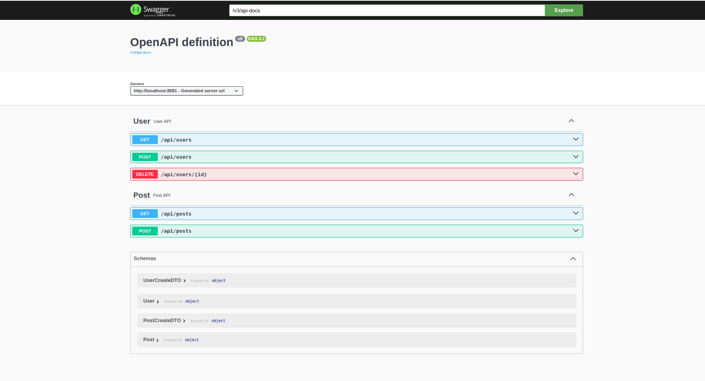

# Spring Kafka Event-Driven Application

## Description
This project implements an event-driven architecture using Spring Boot and Apache Kafka. It provides services for managing users and posts, with events being published to Kafka topics for real-time processing. PostgreSQL is used as the database for persistent storage.

## Prerequisites
Before running the project, ensure you have the following installed:
- [Docker](https://www.docker.com/)
- [Docker Compose](https://docs.docker.com/compose/)
- [Java 17+](https://adoptopenjdk.net/)
- [Maven](https://maven.apache.org/)
- [IntelliJ IDEA](https://www.jetbrains.com/idea/) (optional, for development)

## Environment Variables
The application requires the following environment variables, which should be defined in a `.env` file:

- `POSTGRES_HOST`: Hostname for the PostgreSQL database (default: `postgres`).
- `POSTGRES_PORT`: Port for the PostgreSQL database (default: `5432`).
- `POSTGRES_USER`: Username for the PostgreSQL database (default: `postgres`).
- `POSTGRES_PASSWORD`: Password for the PostgreSQL database (default: `postgres`).
- `POSTGRES_DB`: Name of the PostgreSQL database (default: `postgres`).
- `KAFKA_BOOTSTRAP_SERVER`: Kafka bootstrap server address (default: `kafka:9092`).


## Event-Driven Architecture
This project uses Kafka to implement an event-driven architecture. Key components include:


* Producers: Publish events to Kafka topics (e.g., UserService and PostService).
* Consumers: Listen to Kafka topics and process events.
* Topics:
    * UserTopics.USER_CREATED: Published when a user is created.
    * UserTopics.USER_REMOVED: Published when a user is deleted.
    * PostTopics.POST_CREATE: Published when a post is created.


## Setup

### 1. Clone the Repository
```bash
git clone git@github.com:adelchellabi/event-driven-architecture.git
cd event-driven-architecture
```

### 2. Configure Environment Variables
Copy the example .env file in the root folder and inside spring-kafka folder and update it with your custom values if needed:
```bash
cp .env.example .env
```

### 3. Start Docker Containers
Start the required services (PostgreSQL and Kafka) using Docker Compose:
```bash
docker-compose up -d
```

### 4. Build the Application
Build the application using Maven:
```bash
mvn clean install
```

### 5. Run the Application

You can run the application using your IDE or from the command line:
```bash
mvn spring-boot:run
```
## Usage
- The application provides APIs for managing users and posts.
- Events are published to Kafka topics when users are created or deleted and when posts are created.

### Access the Application
Please access the documentation at `http://localhost:8081/swagger-ui/index.html` to see the available endpoints.



To access kafka topics, you can visit the Kafka UI at `http://localhost:8080`

## License
This project is licensed under the MIT License.

## Contributing
Contributions are welcome!.